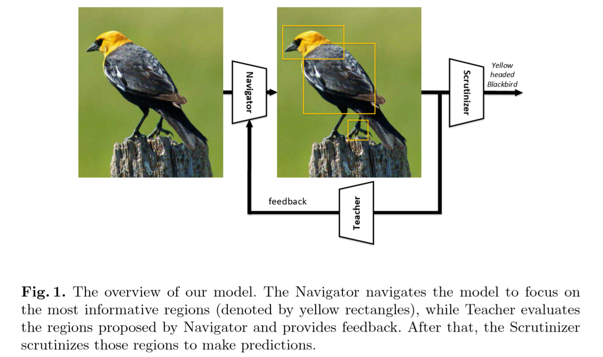

# 2018 Learning to Navigate for Fine-grained Classification

学习如何进行细粒度分类
Navigator-Teacher-Scrutinizer Network (NTS-Net):

## 概要

自监督机制定位区域信息，不需要边界框与部件标注。

强化学习

NTS-Net 网络由 __三部分组成__：

- __Navigator agent 导航者（参与者）__ 导航模型以关注信息最丰富的区域
    对于图像中的每个区域，Navigator 预测该区域的信息量，并且该预测被用来提出信息量最丰富的区域。
- __Teacher agent 教师（批评家）__ 评估 Navigator 提出的区域并提供反馈
    对于每个建议的区域，教师评估其属于真实类的概率
    可信度评估指导 Navigator 使用我们新颖的 __有序一致损失函数__ 提出更多信息量的区域
- __Scrutinizer agent__ 审查 Navigator 提出的区域，并进行细粒度分类
    每个建议的区域被放大到同样的大小，并提取其中特征。
    区域特征和整个图像联合处理以进行细粒度分类。

可视为多智能体的合作，各 agent 相互受益共同进步。

主要贡献：

- __多智能体合作学习机制__
- __新颖的损失函数__
- 端到端训练，良好的预测结果

> Learning to rank
> 机器学习和信息检索领域。
> 