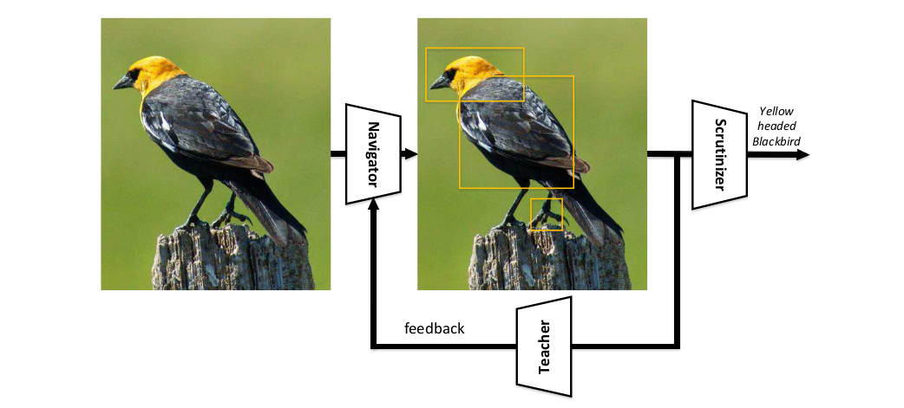
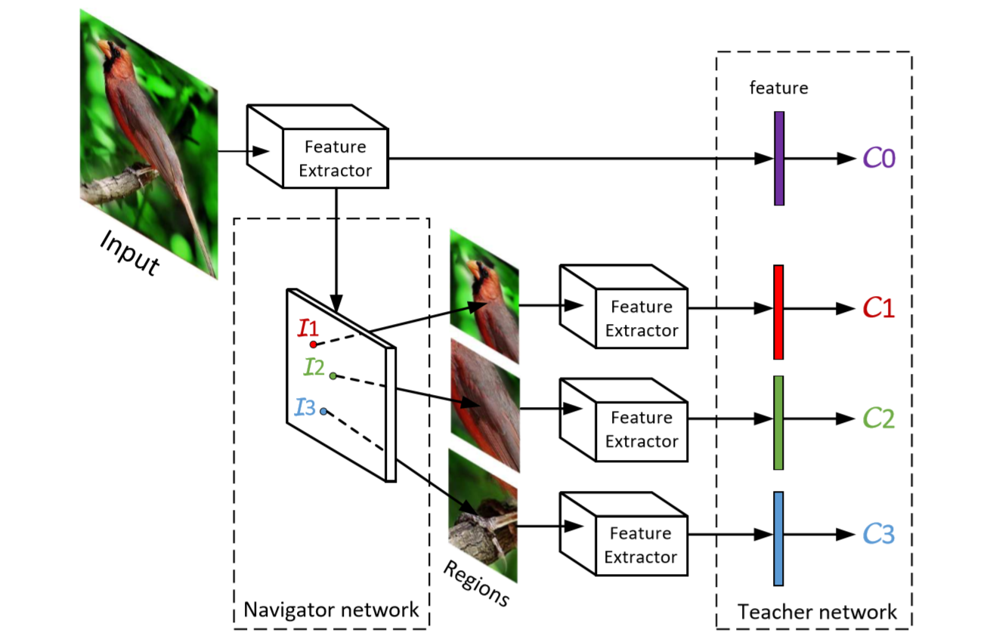
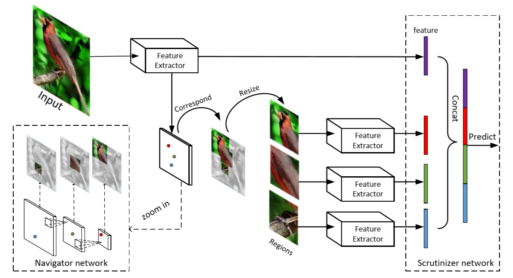
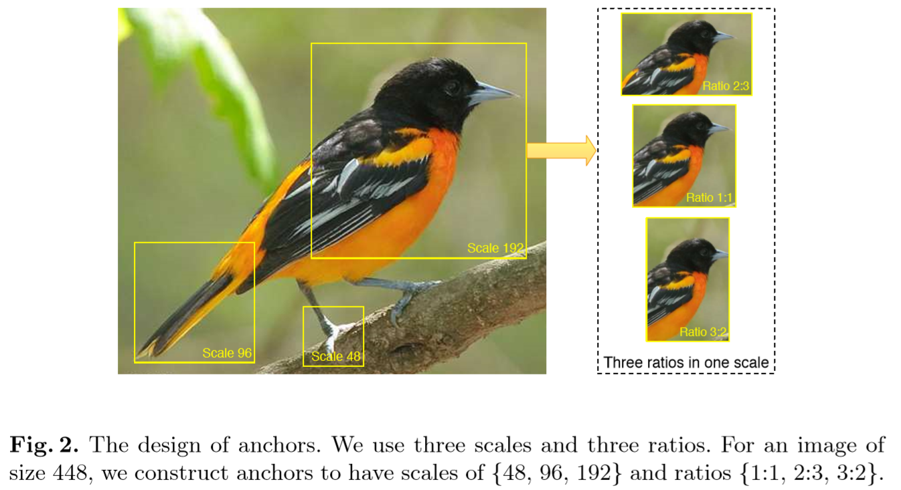
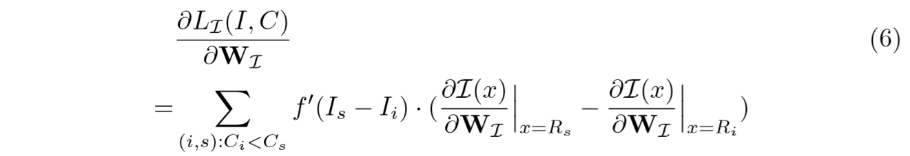
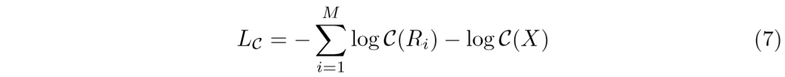
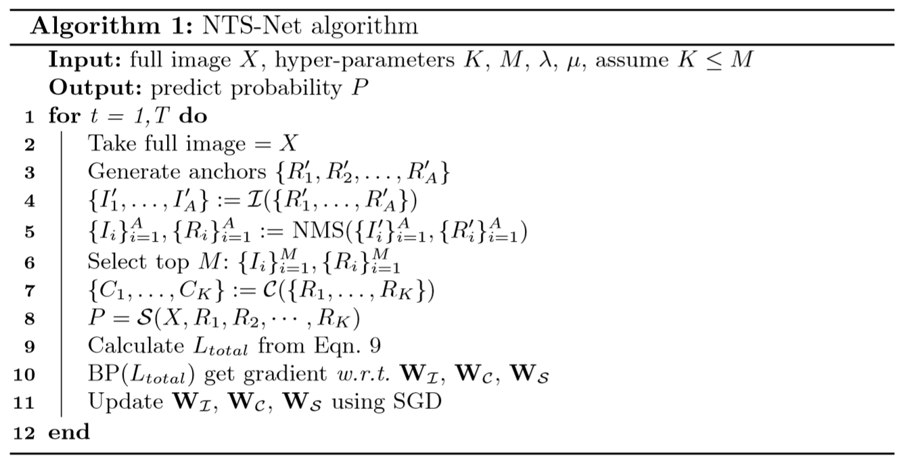

# 2018 Learning to Navigate for Fine-grained Classification

学习如何进行细粒度分类
Navigator-Teacher-Scrutinizer Network (NTS-Net):

[TOC]

## 概要

自监督机制定位区域信息，不需要边界框与部件标注。

强化学习

NTS-Net 网络由 **三部分组成**：

- **Navigator agent 导航者（参与者）** 导航模型以关注信息最丰富的区域
  对于图像中的每个区域，Navigator 预测该区域的**信息量**，并且该预测被用来提出信息量最丰富的区域。
- **Teacher agent 教师（批评家）** 评估 Navigator 提出的区域并提供反馈
  对于每个建议的区域，教师评估其属于真实类的概率,**置信度**
  可信度评估指导 Navigator 使用我们新颖的 **有序一致损失函数** 提出更多信息量的区域
- **Scrutinizer agent** 审查 Navigator 提出的区域，并进行细粒度分类
  每个建议的区域被放大到同样的大小，并提取其中特征。
  区域特征和整个图像联合处理以进行细粒度分类。

可视为多智能体的合作，各 agent 相互受益共同进步。

主要贡献：

- **多智能体合作学习机制**
- **新颖的损失函数**
- 端到端训练，良好的预测结果

> Learning to rank
> 机器学习和信息检索领域。

$R_1,R_2 \in A,\text{if } \mathcal{C}(R_1) > \mathcal{C}(R_2), \mathcal{I}(R_1) > \mathcal{I}(R_2)$

模型总览.

_Fig.3_ 对于输入图像，特征提取器提取深度特征映射。特征映射 fed into 导航这网络计算所有区域的信息量。在 NMS 后选择 top-M 信息区域，将信息量指定为 $I_1,I_2,I_3$。 取自整图，resize 到预指定的尺寸，将其输入 TeacherNetwork，然后获得置信度$C_1,C_2,C_3$。优化网络使 NavigatorNetwork 使得 信息量大的 置信度高。

_Fig.4 模型的推理过程。输入图像输入到特征提取器，导航网络提出输入信息最丰富的区域。
从输入图像中裁剪出这些区域，并将其调整到预定义的大小，然后使用特征提取器计算这些区域的特征并将其与输入图像的特征融合。最后审查器网络处理融合后的预测标签。_

==这里左图的 Navigator network 不太懂？==

## 2. 相关工作

**首个将 FPN 引入细粒度分类，并消除人工标注。**

### 2.3 Learning to rank

学会排序，吸引了机器学习和信息检索领域的关注。训练数据由分配了顺序的项列表组成，目标：__学会排序这些项的次序__
排序损失函数，被设计来惩罚错序的对。

## 3. 方法

### 3.1 Overview

方法基于假设，**信息区域有助于更好地描述目标**，因此将信息区域的特征与完整图像进行融合，将获得更好的性能。

### 3.2 Navigator and Teacher

Navigator 提取信息量大的区域，Teacher Network 评判区域的置信度。通过网络训练，将 Navigator 和 Teacher 的评判顺序一致：信息量大的区域置信度高。

### 3.3 Scrutinizer

随着 Navigator 网络逐渐收敛，它将产生信息丰富的目标特征区域，以帮助 Scrutinizer 做决策。使用 Top-K 信息区域和完整图像相结合 作为输入来训练 Scrutinizer 网络。

使用信息区域能降低类间变化，在正确标签上生成高置信分数。实验表明，添加信息区域可显著提高细粒度分类结果。

### 3.4 network architecture

为了获得特征图中区域建议与特征向量之间的对应关系，采用完全卷积网络作为特征提取器，不需要全连接层。

**Navigator network**

### 3.5 损失函数和优化

**Navigation loss**. 定义如下

$$L_{\mathcal{I}}(I,C)=\sum_{(i,s):C_i<C_s} f(I_s-I_i) \tag{5}$$

- $R=\{R_1,R_2,\dots,R_M\}$ M 个最有信息的区域
- $I=\{I_1, I_2, \dots, I_M\}$ 对应区域的信息量
- $C=\{C_1, C_2,\dots,C_M\}$ Teacher Network 预测的置信度
- ==hinge loss function== 是什么？
- 鼓励 I 和 C 同顺序

$I_i = \mathcal{I}(R_i)$

**Teaching loss**. $L_{\mathcal{C}}$

- $\mathcal{C}$ 置信度函数，区域映射到真实类的概率。

**Scrutinizing loss**.

细粒度识别结果 $P=\mathcal{S}(X,R_1,R_2,\dots,R_K)$

$$L_{\mathcal{S}} = -\log \mathcal{S}(X,R_1, R_2,\dots,R_K)$$

**联合训练算法** $$L_{total}=L_{\mathcal{I}}+\lambda\cdot L_{\mathcal{S}} + \mu\cdot L_{\mathcal{C}}$$

## 实验部分

## -1.不懂的问题

1. Navigator network 如何判定区域的 **信息量**
2. Teacher network 如何判断区域的 **置信度**
3. NT 两个网络如何进行联合训练？

## -2.思考

1. 最有信息的区域 = 最有判别性的区域。
   从这点上来说，和其他细粒度识别算法没有什么不同。这个模型的在于设计了一个 Teacher network 进行联合训练，从消融实验结果中也可以看出，这个教师网络起到了很大的作用(4% 的性能提升)。
