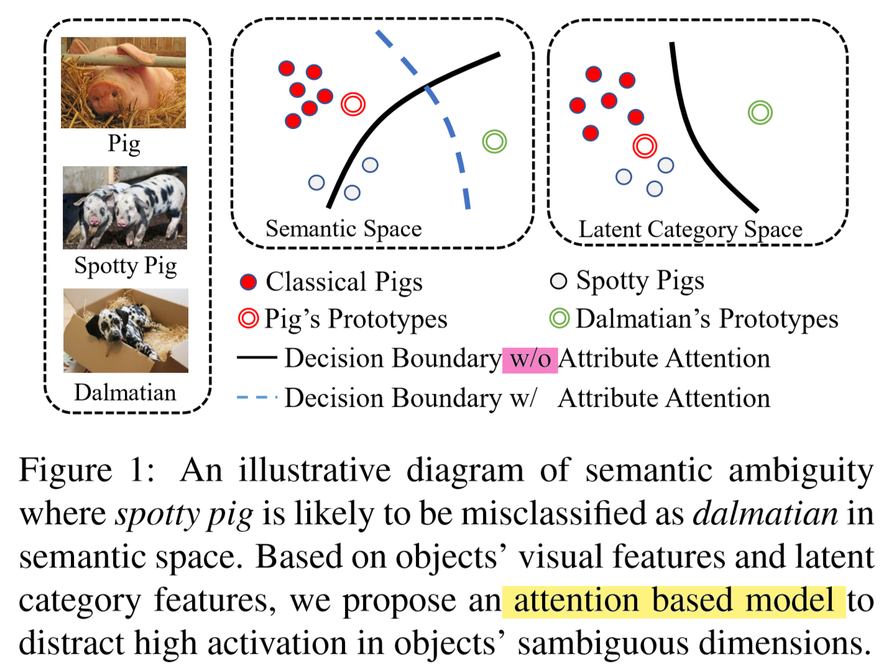
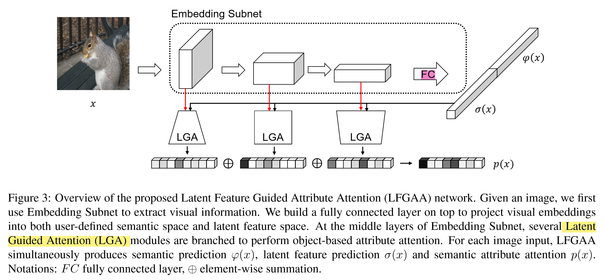
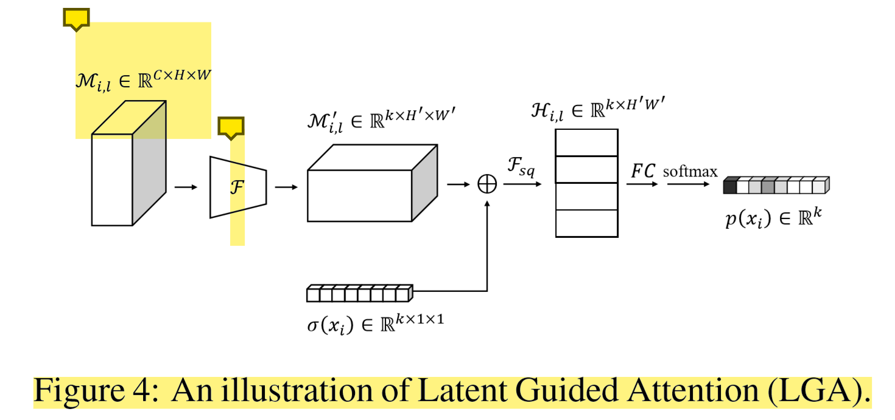
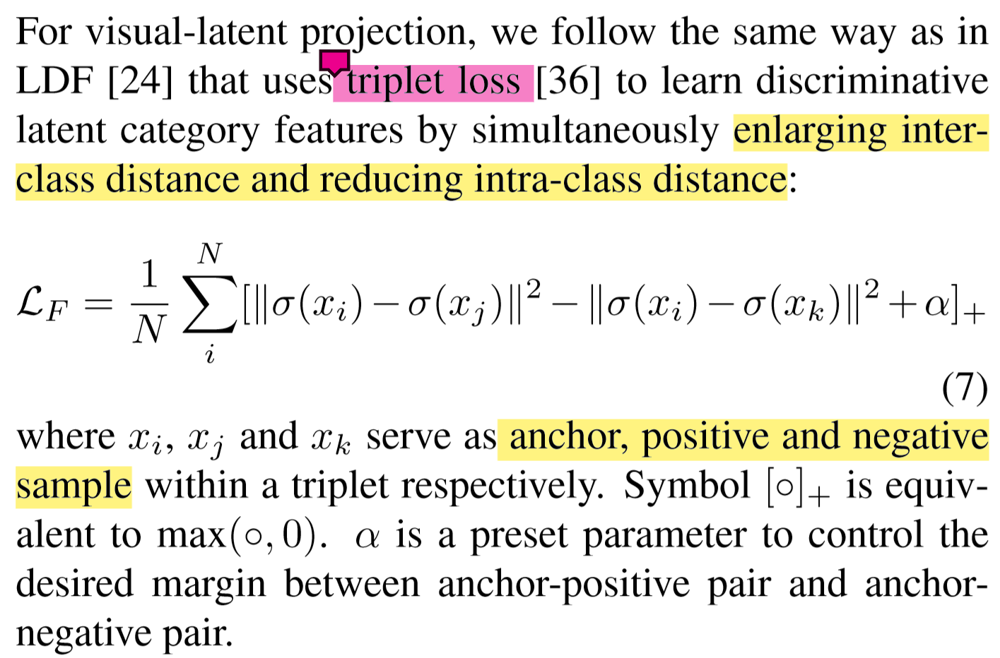

# Attribute Attention for Semantic Disambiguation in Zero-Shot Learning

9.24 20:00 黄绿青

## Q1. **图里的 w/o 是什么？**

------------------------------------------

## Q2. **这张图中，Embedding Subnet生成 潜在特征$\sigma(x)$语义预测和$\varphi(x)$的过程？是分别生成，再拼接在一起？还是 FC 后的特征进行划分？**

------------------------------------------

## Q3. **这张图中 $\bigoplus$ 运算的物理意义是什么？各个 chennel 逐元素加上相同的数？为什么要这样做？**

------------------------------------------

## Q4. **这个 triplet loss 扩大类间距离和减少类内距离该如何理解？$x_j$和$x_k$从哪儿来的**

## Record

零次学习 Zero Shot Learning

* 人的学习过程 模仿 - 机器学习

分类：

* 归纳式
* 直推式

语义歧义

语义属性
潜在类别特征

定义两个数据集

训练 + 测试集 通过训练集中学到的属性集合，推广到测试集中。
从视觉空间映射到语义映射。

属性注意力机制。

0. 内积
1. 余弦距离

基于对象的属性注意的兼容分数。