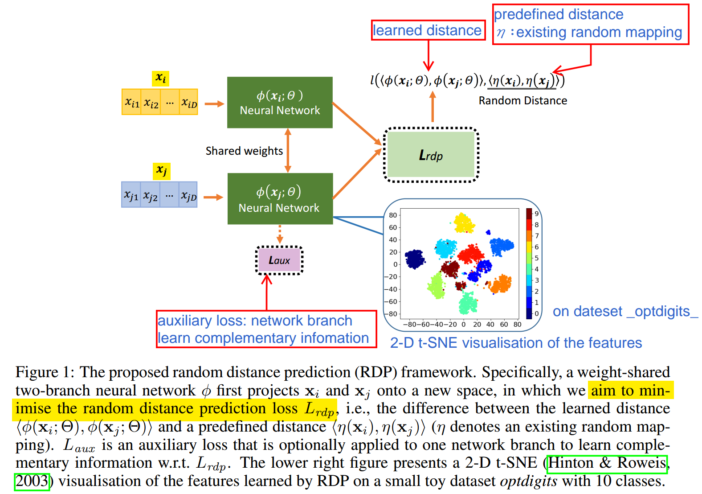
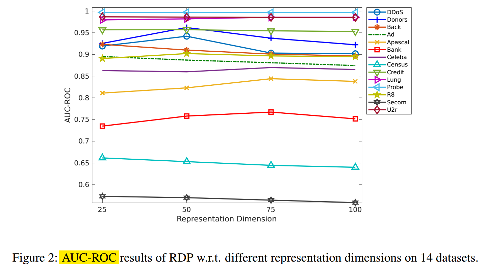
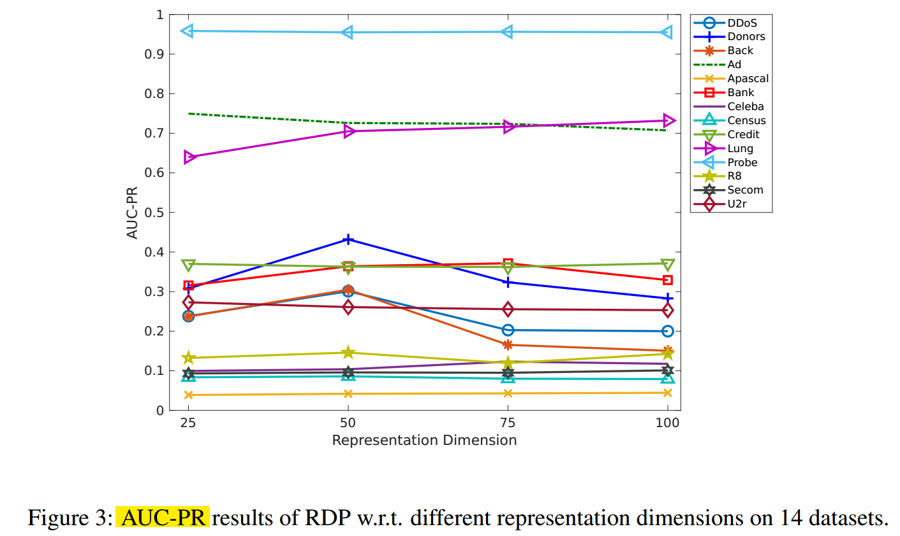

# 9.26 Unsupervised Representation Learning by Predicting Random Distances

> 基于 __预测随机距离__ 的无监督表示学习
9.26 09:00 孙萌婧

## Abstract

深度神经网络在无监督学习领域的应用。而标注数据成本高昂，为了实现务监督学习，本文 __不使用任何标记数据__ 的情况下，通过训练神经网络来 __预测随机投影空间中的数据距离__ 来学习特征。
随机映射 一种从理论上证明的 获得近似保持距离的方法。
为了更好地预测随机距离，表征学习被优化为学习真正的类结果，这些结构隐含在随机投影的空间中。

## Conclusion

RDP 随机距离预测模型。通过预测随机投影空间中的数据距离，以完全无监督的方式学习特征。

## Details

## Quesion

### Q1. 随机映射是什么？有什么作用？ 图中 右上角的 预定义映射η 如何选取，以及对网络性能的影响。

### Q2. 图中为何对 $\phi(x_j;\theta)$ 神经网络（下方绿框）增加损失 $L_{aux}$ 并共享权重，为何不使用同一个神经网络？

----------------------------

### Q3. 下图3的 AUC-PR 怎么看？

> AOC Aera Under Curve

> ROC (Receiver operating characteristic)
> * 横坐标为FPR 伪阳性率
> TPR = TP / (TP + FN)
> 即所有真实类别为1的样本中，预测类别为1的比例
> 也就是召回率（是正例，预测也为正例）
> * 纵坐标为TPR 真阳性率
> FPR = FP / (FP + TN) 
> 即所有真实类别为0的样本中，预测类别为1的比例
> 从 (0, 0) 到 (1,1) 的对角线将ROC空间划分为左上／右下两个区域，在这条线的以上的点代表了一个好的分类结果（胜过随机分类），而在这条线以下的点代表了差的分类结果（劣于随机分类）。

